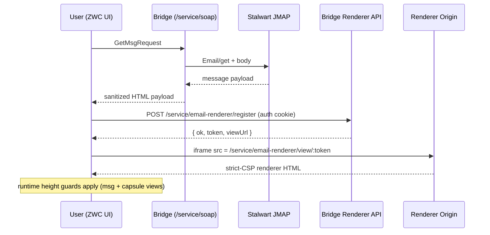
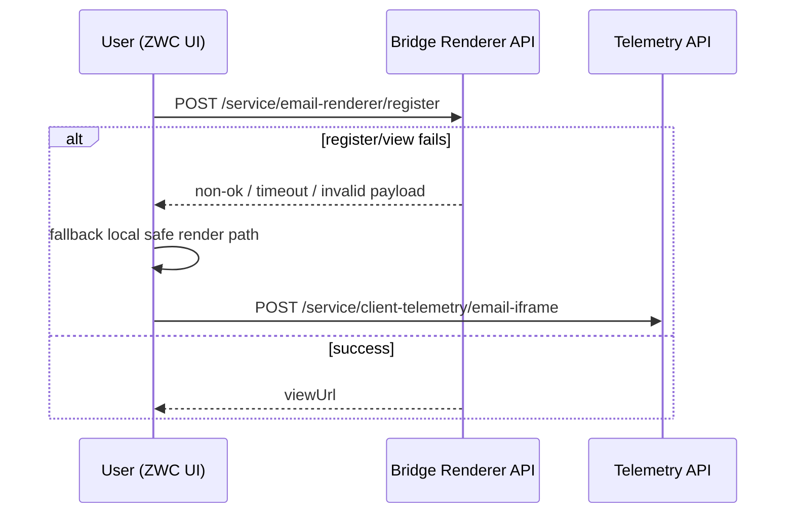
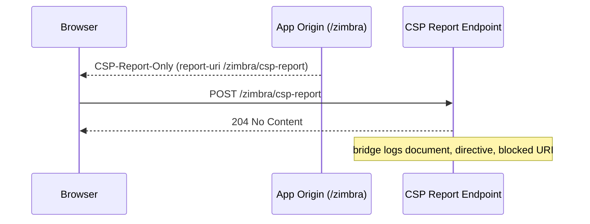
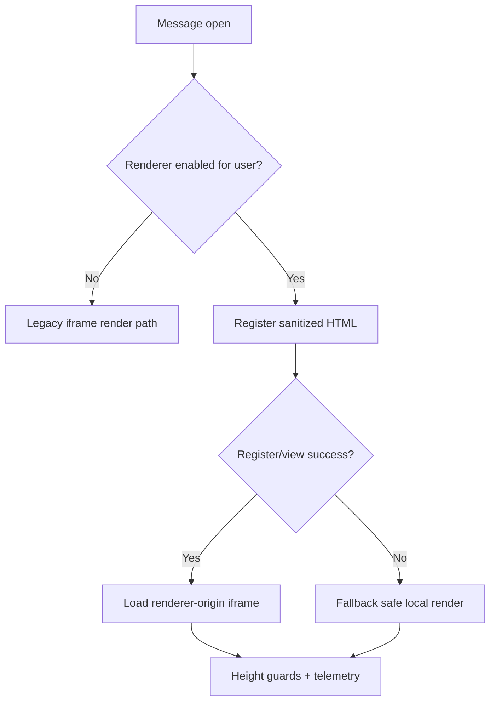

# SECURITY: Iframe + Strict CSP Sequence (One-Page)

Date: 2026-02-27  
Status: Quick reference for debugging and onboarding  
Related: `docs/security/SECURITY_IFRAME_STRICT_CSP_DESIGN.md`

## Scope

This page shows the runtime sequence for hardened email-body rendering:
1. normal renderer-origin flow
2. fallback flow when renderer registration/view fails
3. CSP violation reporting path

## Normal Flow



## Fallback Flow



## CSP Reporting Flow



## Runtime Decision Model



## High-Value Debug Signals

1. Renderer success:
   - `iframe_renderer_loaded`
2. Renderer failures:
   - `iframe_renderer_failed`
3. Height containment:
   - `renderer_iframe_height_guard_applied`
   - `capsule_resize_*`
4. CSP pipeline:
   - `csp report ... violated_directive=... blocked_uri=...`

## First Commands to Run During Incident

```bash
./manage.sh logs | rg "iframe_renderer|height_guard|capsule_resize|csp report"
./manage.sh run env | rg "^BRIDGE_CSP|^BRIDGE_EMAIL_IFRAME"
curl -k -I -s https://<host>/zimbra | rg -i "content-security-policy|report-uri"
```
